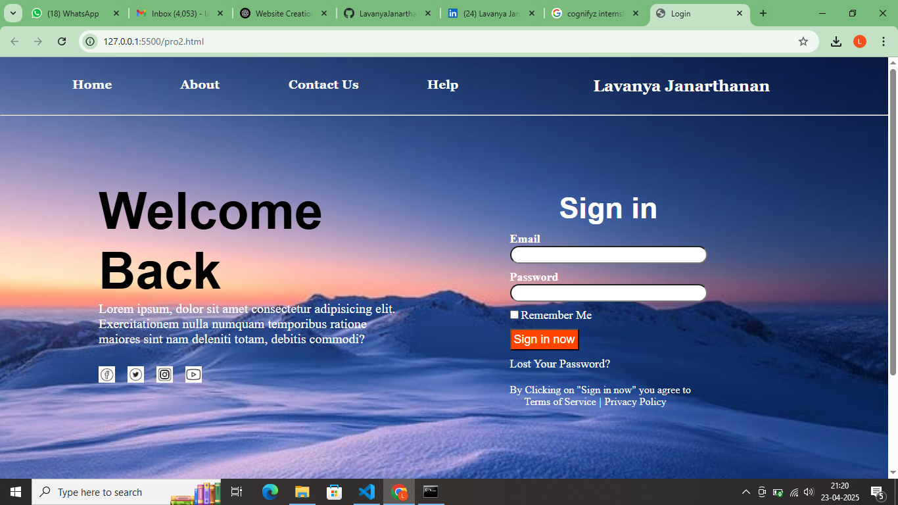

# Sign-In Page using HTML & CSS

🚀 A clean and responsive sign-in page built using only HTML and CSS.  
This project focuses on form structure, styling, and responsive design.

## 🔍 Preview

## 📂 Project Structure
sign-in-page/ 
├── index.html 
└── style.css

## 🌐 Live Demo
👉 [Click here to view the live site](https://LavanyaJanarthanan.github.io/sign-in-page/)

## 🛠️ Tech Used
- HTML5
- CSS3

## 📬 Contact
Feel free to connect on [LinkedIn](https://www.linkedin.com/in/your-linkedin/) or fork the repo and suggest improvements!
